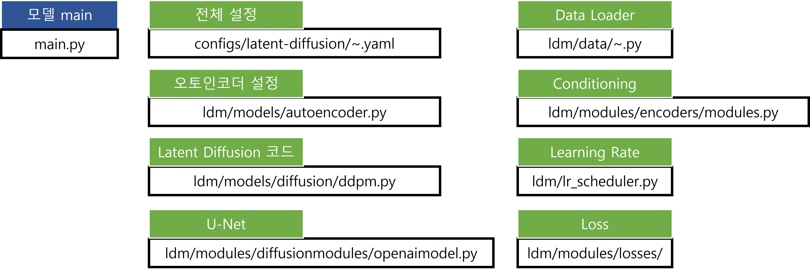

# Capstone Design in ICT, Spring 2023
## git 사용
```
git checkout <브랜치>
git pull origin main
# 파일 수정
git commit -am "<코맨트>"
git push
# pull request
```

# DONE
* ~~서버에 환경 설정~~
<br>`conda activate ldm`

* 코드 구조
<br>

## TO DO
* ~~서버에 환경 설정~~
* [Latent Diffusion](latent-diffusion/) 코드 분석 (~03/20)
* 0320
